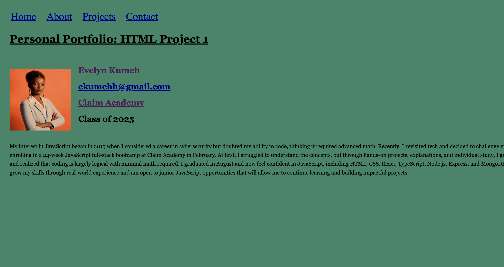

# HTML Mini Project 1 - Fundamentals Practice

## Description
I like to learn from the basics to advanced to fully understand the principles. On my journey to becoming a skilled JavaScript Fullstack Developer, it’s essential to master each concept step by step. Since JavaScript is built on the foundation of HTML and CSS, my starting point is HTML.

The purpose of this project is to focus on fundamental HTML concepts such as:
- Navigation bars
- Div containers
- Images and links
- Paragraphs
- Unordered and ordered lists
- Inline styling

## Technologies Used
- HTML5
- CSS3 (for inline styling practice)

## How to Use
1. Clone or download the repository.
2. Open the `index.html` file in your web browser.
3. Explore the page and observe the use of HTML elements.

## Screenshot

## License
This project is open-source and free to use.
